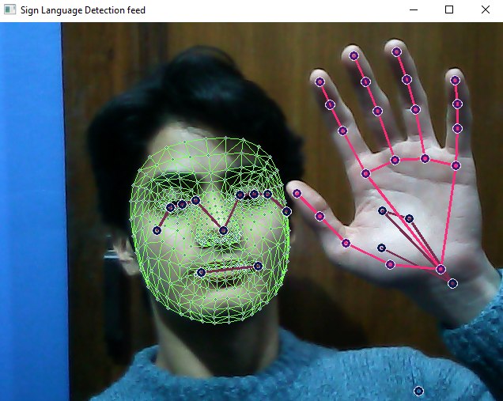
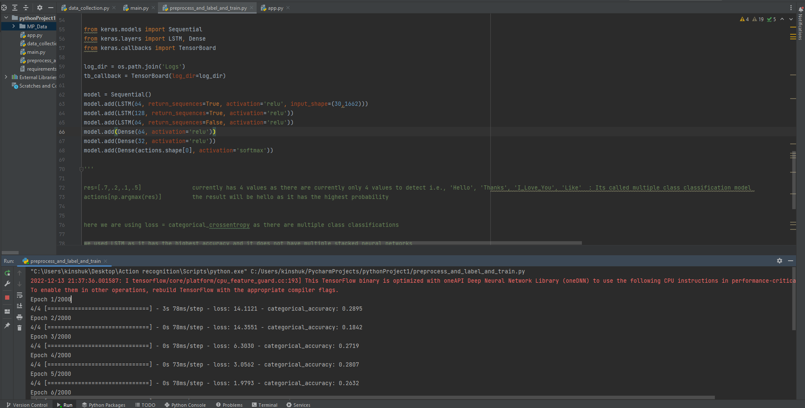
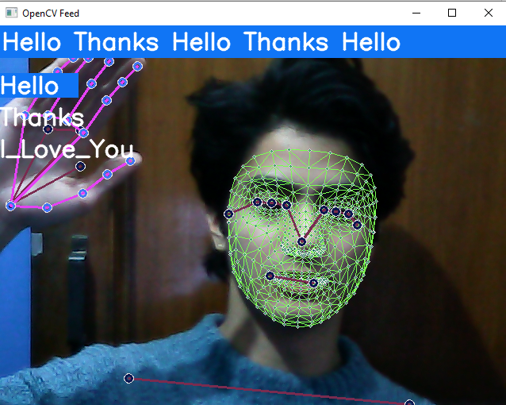
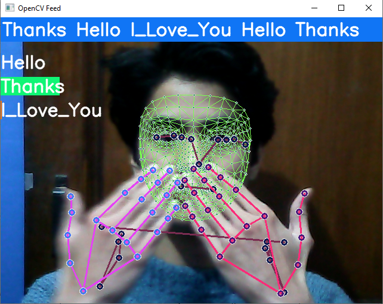
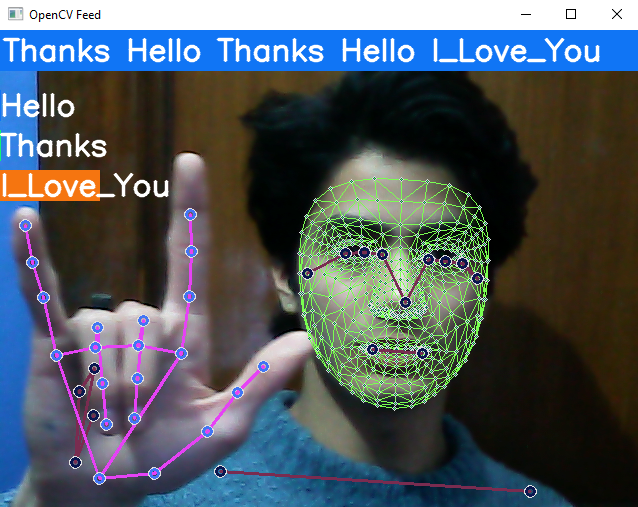

<h1> Sign-Language-Detection-ML-Project</h1>
Sign language detection using Action Recognition [LSTM Deep Learning Model]

<h3>python helpful shortcuts:</h3>
to install a requirements.txt file : pip install -r requirements.txt  
to make a requirement.txt file : pip freeze > requirement.txt
to install all these required dependencies :  
pip install tensorflow opencv-python mediapipe sklearn matplotlib  
                    or  
download the requirement.txt file in the Project folder and use this command :  
***pip install -r requirements.txt*** 

<h2>GOALS</h2>
1.Extractholistic points 
2.Train an LSTM dl model 
3.Make real-time predictions using sequences 

<h2>HOW IT WORKS:</h2>
1.	Collect key points from media pipe holistic  
2.	Train a deep neural network with LSTM layers for sequences 
3.	Perform real-time sign language detection using OpenCV 

<h1>WORKFLOW</h1>
01.	Import and install dependencies 
02.	Keypoints using MP Holistics 

03.	Extract keypoint values 
04.	Setup folders for collection 
05.	Collect keupoints values for training and testing 
06.	Preprocess data and create labels and features 
07.	Build and train LSTM Neural network 

08.	Make predictions 
09.	Save weights 
10.	Evaluate using confusion matrix and accuracy 
11.	Test in real time . 

# Predicting Hello 

# Predicting Thanks 

# Predicting I Love You

